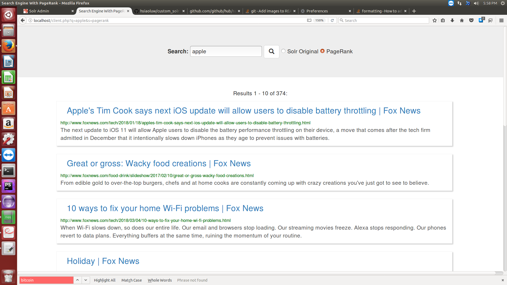

This project cutomizes Solr for information retrieval on web documents.


The projects includes three other functions:
* Include pagerank for web documents.
* Search the snippets in the documents.

* Allow autocompletion which returns up to five most posible completions, and allow spell checking which reuturns the most possible correct term to the user.


PHP server set up
============================
* [set up the apache server.](https://httpd.apache.org/docs/trunk/getting-started.html)
* [Install php](https://httpd.apache.org/docs/trunk/getting-started.html)
* Put the files of php_server in to the root of your apache server,  like /var/www/html.

Compute page rank
=======================
To compute pagerank, we need two programs. First, use ExtractLinks.java to extract the links in the documents. The generated link informations is stored in ouput.txt.
Compute_pagerank later computes the pagerank score. Remember to download the python librarty [networkx](https://pypi.python.org/pypi/networkx/), and include external jar library [jsoup](https://jsoup.org/download)

```
javac ExtractLinks.java
java  <document dir path> <mapping file> <output.txt>
python2 compute_pagerank.py [output.txt] [external_pageRankFile]
```
Now we have the pagerank score in external_pageRankFile.
Map file includes the document name to real url, documents path store all the documnets to be indexed by Solr.

Solr set up and configuration
=============================
* [download solr](https://lucene.apache.org/solr/) 
* cd into solr-7.x.x (or highter version) folder, use the command to start solr server
```
bin/solr start
```
* create a new core called custom_solr
```
bin/solr create -c custom_solr
```
* copy the files /solr_conf into solr-7.x.x/solr/server/solr/custom_solr/conf
* copy the created  external_pageRankFile into solr-7.x.x/solr/server/solr/custom_solr/


Test the search results
============================
Now we can test the search results on the server. Open the browser, and search

```
http://<server address >/client.php
```

You will see the search page. You can also find the difference of search results between Solr original score rank, pagerank.


